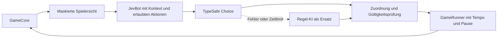

# Jev als zusätzlicher Skylo Bot

Stand: 5. Oktober 2026. Dieses Konzept beschreibt die Integration; der TypeSafe-Skill ist für Codex installiert. Die erste Integration und drei begrenzte API-Prüfungen sind inzwischen umgesetzt; Betrieb, Freigabegrenzen und Validierung stehen in [Jev · TypeSafe: Betrieb und Validierung](jev-bot-implementation.md).

Jev soll als eigener Bot neben Regel-KI und Zufallsbot auswählbar sein. Menschen können gegen ihn spielen, und Zuschauer können Partien mit Jev und anderen Bots verfolgen. Empfehlung für die erste Version: Jev wählt über TypeSafes `Choice` aus allen erlaubten Aktionen. Skylo berechnet bekannte Folgen, prüft die Entscheidung und führt sie aus. Ein späterer Bot, der Jev mit Regeln oder Suche kombiniert, erhält eine eigene Strategiekennung für aussagekräftige Vergleiche.

## Grundlage und geprüfte Schnittstelle

Der [installierte TypeSafe-Skill](../.agents/skills/typesafe-ai/SKILL.md) wurde mit `npx skills add typesafe-ai/skills --skill typesafe-ai --agent codex --yes` installiert. Die Definition und Lizenz liegen im Repository; `skills-lock.json` hält die Quelle und deren Hash fest.

Bei Erstellung des Konzepts war die Live-Dokumentation unter `https://docs.typesafe.ai/llms.txt` wegen der Netzwerkregeln nicht erreichbar. In der aktualisierten Umgebung wurde sie für die Umsetzung erfolgreich geprüft. Als vom Skill vorgesehene Ersatzquelle wurden das offizielle JavaScript-SDK `@typesafe-ai/sdk` in Version `0.6.0`, dessen veröffentlichte Typen und das [offizielle SDK-Repository](https://github.com/typesafe-ai/typesafe-sdk-js) geprüft. Das SDK wurde dafür separat heruntergeladen; die Anwendung hat bislang keine neue SDK-Abhängigkeit.

Verifiziert sind `TypeSafeClient.systemOne`, `choice`, `score`, `noul`, Abbruch über `AbortSignal`, Tokenverbrauch im Ergebnis und `client.models.list()`. Das SDK verwendet standardmäßig den Modellnamen `jev-latest`. Die tatsächlich verfügbaren Modelle, aktuelle Limits, Preise und Antwortzeiten müssen mit dem verwendeten Account und der Live-Dokumentation vor dem produktiven Anschluss geprüft werden.

Jev liefert typisierte Urteile und Wahrscheinlichkeiten. Es erzeugt dabei keine freie Zugbegründung. Ob es Skylo gut spielt, muss ein Spielvergleich zeigen; die API allein belegt keine Spielstärke.

## Ablauf einer Entscheidung



Die bestehende Schnittstelle `BotStrategy.decide(observation, legalActions, context)` bleibt der Einstieg. Eine Registrierung wie `typesafe-jev-choice`, Version `1`, erzeugt pro Bot einen `JevBot`; ein gemeinsamer serverseitiger TypeSafe-Client und ein begrenzter Request-Scheduler bedienen die Bot-Instanzen.

Der Adapter baut einen kompakten JSON-Kontext ausschließlich aus `PlayerObservation`, erlaubten Aktionen, beobachteten öffentlichen Ereignissen und öffentlichen Spielregeln. Jede Aktion bekommt eine lokale Kennung wie `a0`. Jev wählt diese Kennung; der Adapter ordnet sie der unveränderten `GameAction` zu. Sämtliche aktuell erlaubten Aktionen bleiben auswählbar, auch wenn die Regel-KI sie schlecht bewerten würde.

Eine einzelne erlaubte Aktion kann der Server direkt ausführen und als automatische Entscheidung protokollieren. Die nächste Runde wird wie bisher vom Runner gestartet. Bei mehreren Aktionen entscheidet Jev. Die erste Version benötigt keinen Chatverlauf; der Zustand enthält die aktuelle Lage und gegebenenfalls eine begrenzte Zusammenfassung beobachteter Ereignisse.

Ein Zug kann mehrere Entscheidungen enthalten. Zunächst wählt Jev etwa zwischen Ziehen und Ablagestapel. Erst wenn die tatsächlich gezogene Karte bekannt ist, entscheidet es über Einsetzen oder Abwerfen. Nach Abwerfen folgt gegebenenfalls eine weitere Entscheidung über das Aufdecken. Jede Anfrage bezieht sich auf die aktuelle Revision und deren aktuellen Informationsstand.

## Informationen für Jev

| Kontext | Inhalt und Bedeutung |
| --- | --- |
| Regeln und Ziel | Niedrigste Gesamtpunktzahl gewinnt; Punktelimit, Kartenverteilung, Aufdecken, Tauschen, Ablage, sichtbare Dreier-Spalten und Rundenschluss. Versionsgebundener, kurzer Regeltext aus den tatsächlich implementierten Regeln. |
| Eigenes Blatt | Spalten, Positionen, sichtbare Werte, verdeckte Karten als `null`, aufgenommene Karte, sichtbare Punktesumme und Gesamtpunkte. |
| Andere Spieler | Sichtbare Karten, Anzahl verdeckter Karten, Gesamtpunkte, Sitzreihenfolge und bereits ausgelöste Schlussphase. Neutrale Sitzbezeichnungen reichen; Spielernamen sind für die Entscheidung unnötig. |
| Stapel und Verlauf | Öffentlicher Ablagestapel, Größe des Nachziehstapels und gegebenenfalls eine kompakte, begrenzte Zusammenfassung bereits beobachteter Aktionen. |
| Aktionskandidaten | Alle erlaubten Aktionen mit verständlicher Bedeutung, stabiler lokaler Kennung und aus der Beobachtung berechneten bekannten Folgen. |
| Bekannte Folgen | Beispielsweise Austausch einer sichtbaren `12` gegen `0`, sichere Entfernung einer sichtbaren Dreier-Spalte, verbleibende verdeckte Karten und Auslösen des Rundenschlusses. Unbekannte Folgen bleiben ausdrücklich unbekannt. |

Verdeckte Werte, die Reihenfolge des Nachziehstapels, der Partie-Seed und der vollständige `GameCore` gelangen nicht zum Anbieter. Sichtbare Rundenpunkte sind während einer laufenden Runde nur eine Teilsumme. Ein gesondert berechneter Erwartungswert wäre als Schätzung zu kennzeichnen; er ersetzt keine beobachtete Karte.

Die Punktelimit-Konfiguration muss als öffentliche Regelinformation verfügbar werden: Sie ist derzeit kein Feld in `PlayerObservation`. Für die erste Version lässt sie sich über einen vom Runner bereitgestellten öffentlichen Regelkontext übergeben; ein konfigurierbares Limit darf nicht still als `100` angenommen werden.

## Rundenschluss als Teil der Strategie

Skylo hat keine separate Aktion „Runde beenden“. Wenn nach dem Zug alle verbleibenden eigenen Karten aufgedeckt sind, löst der Kern die Schlussphase aus. Die anderen Spieler erhalten ihren letzten Zug. Anschließend werden verbliebene Karten aufgedeckt, Dreier-Spalten entfernt und die Rundenpunkte gewertet.

Die Kandidatenbeschreibung markiert deshalb Aktionen, die die Schlussphase auslösen. Jev bekommt die eigenen bekannten beziehungsweise nach einem Tausch sicher bestimmbaren Punkte, die sichtbaren Gegnerblätter, deren unbekannte Karten und die Gesamtstände. Es soll kurzfristige Verbesserung, Spaltenpotenzial, gegnerische letzte Züge und die Chancen über die ganze Partie abwägen.

Der Regeltext nennt ausdrücklich unsere vereinbarte Wertung: Ist der abschließende Spieler nicht allein der Spieler mit der niedrigsten Rundenpunktzahl, werden nur seine positiven Rundenpunkte verdoppelt. Null und negative Werte bleiben unverändert. Gleichstand genügt bei positiven Punkten für die Verdopplung. Gerade an diesen Situationen wird die Jev-Strategie gezielt geprüft.

## TypeSafe Fragen

Für den Start genügt eine `Choice`-Frage: „Welche Aktion aus `candidates` bietet angesichts von `rules`, `self`, `opponents` und `roundStatus` die beste Chance auf die niedrigste Gesamtpunktzahl am Partieende?“ Jede Antwortoption beschreibt genau einen legalen Kandidaten und dessen bekannte Konsequenzen. Regeln und numerische Folgen werden vom Server bereitgestellt; der Adapter fügt keine Rangfolge der Regel-KI hinzu.

Schematischer Aufruf auf Basis des geprüften SDK:

```ts
import { choice, TypeSafeClient } from "@typesafe-ai/sdk";

// Einmal serverseitig erzeugen; Schlüssel aus TYPESAFE_API_KEY.
const client = new TypeSafeClient({
  retry: { maxRetries: 0 },
  logLevel: "warn",
});

// Innerhalb des Adapters; Hilfsfunktionen sind Teil der geplanten Umsetzung.
const candidates = buildCandidates(observation, legalActions);
const criteria = Object.fromEntries(
  candidates.map((candidate) => [candidate.id, candidate.description]),
);

const result = await client.systemOne({
  model: serverConfig.model,
  state: buildJevState(observation, publicRules, candidates),
  questions: {
    action: choice(
      "Choose the action in `candidates` that best advances the lowest " +
      "final total score, considering `rules`, `self`, `opponents`, " +
      "and `roundStatus`. Treat hidden cards as unknown.",
      criteria,
    ),
  },
}, {
  signal: context.signal,
  timeout: remainingDecisionMs,
});

const selected = candidates.find((c) => c.id === result.answers.action.choice);
// Antwort prüfen, aktuelle Revision prüfen, dann selected.action übernehmen.
```

`Choice` liefert die gewählte Option, `confidence` und eine Verteilung über die Optionen. Diese Verteilung ist keine Gewinnwahrscheinlichkeit. Mehrere ähnlich gute Züge können eine geringe Konzentration ergeben. Die erste Version verwendet deshalb keinen willkürlichen Confidence-Schwellwert, der Jev heimlich durch einen anderen Bot ersetzt.

Später können unabhängige Zusatzfragen im selben Request beantwortet werden: ein `Noul` zur eingeschätzten Gefahr eines konkret beschriebenen Rundenschlusses oder vergleichbare `Score`-Fragen zur Bewertung von Kandidaten. Solche Fragen verursachen zusätzlichen Tokenverbrauch und müssen einen messbaren Nutzen haben. Antworten desselben Requests können sich nicht gegenseitig als Eingabe dienen. Eine darauf aufbauende Kombination mit Regeln oder Monte Carlo wird als eigene Strategie geführt, etwa `typesafe-jev-hybrid`.

## Tempo und Lebenszyklus

Der Temporegler steuert weiterhin die zusätzliche Wartezeit pro Bot-Aktion. Bei einer fertigen Entscheidung erfolgt die Ausführung frühestens nach der eingestellten Mindestdauer seit Entscheidungsbeginn. Bei `0 ms` bleibt die tatsächliche API-Antwortzeit bestehen. Der Regler ändert weder Modell, Fragen noch Entscheidungsbudget.

| Situation | Verhalten |
| --- | --- |
| Tempo während einer Anfrage ändern | Der laufende Request bleibt bestehen; der Runner berechnet nur den Ausführungszeitpunkt neu. |
| Pause während einer Anfrage | Die Anfrage darf fertig werden. Die Antwort wartet auf Fortsetzen oder Einzelschritt. Während Pause entstehen keine neuen Entscheidungen. |
| Einzelschritt | Die benötigte Entscheidung wird abgewartet und dann eine Aktion beziehungsweise ein vollständiger Zug ausgeführt. |
| Partie stoppen oder ersetzen | Wartende Requests werden abgebrochen; verspätete Antworten können den Spielzustand nicht verändern. |
| API langsam oder nicht verfügbar | Nach dem festen Entscheidungsbudget folgt eine klar markierte Ersatzentscheidung. |

Der Runner hat aktuell ein Standardbudget von `1.000 ms`. Für Remote-Bots braucht die Registrierung ein eigenes serverseitiges Budget. Als zu messender Anfangswert werden `3.000 ms` pro Entscheidung vorgeschlagen; das ist keine Zusage zur Jev-Latenz. Lokale Bots behalten ihr bisheriges Budget.

Das Gesamtbudget umfasst Wartezeit im Request-Scheduler, HTTP-Aufruf und Antwortverarbeitung. `AbortSignal` wird durchgereicht; der SDK-Timeout nutzt nur die noch verbleibende Zeit. Das SDK hat standardmäßig zwei Wiederholungen und einen Timeout pro Versuch statt eines gemeinsamen Retry-Budgets. Für die erste Version werden automatische Retries deaktiviert. Ein Abbruch kann eine bereits serverseitig begonnene, möglicherweise berechnete Inferenz nicht garantiert kostenfrei machen.

## Fehlerbehandlung und Begrenzungen

Der Adapter prüft Antwortform, bekannte Kandidatenkennung und endliche Wahrscheinlichkeiten im gültigen Bereich. Der Runner prüft weiterhin die Legalität und die Zustandsrevision. Bei Timeout, Transportfehler, Rate-Limit, ungültiger Antwort oder ausgeschöpftem Budget nutzt er die bestehende mittlere Regel-KI als Ersatz. Fehlergrund und tatsächliche Entscheidungsquelle werden gesondert gespeichert und angezeigt.

Wiederholte Anbieterfehler öffnen einen Circuit Breaker: Nach einer definierten Fehlerfolge werden für eine begrenzte Zeit keine weiteren API-Aufrufe versucht. Die Partie kann mit sichtbar gekennzeichneten Ersatzentscheidungen weiterlaufen. Ein gedeckelter globaler Scheduler begrenzt parallele Requests; pro Bot und Revision existiert höchstens eine Entscheidung.

Die Serverkonfiguration legt Modell, Zeitbudget, erlaubte Nutzung und Obergrenzen für Requests pro Partie sowie insgesamt fest. Tokenverbrauch wird erfasst; zusätzliche Kostenschätzungen benötigen den dann gültigen Tarif. Request-Grenzen lassen sich schon ohne unbekannte Preise hart durchsetzen. Öffentliche Lobby-Einstellungen können weder Modellnamen noch Provider-URL, API-Schlüssel oder Kostenlimits frei überschreiben.

Der Schlüssel bleibt als `TYPESAFE_API_KEY` ausschließlich im Backend beziehungsweise im Deployment-Secret. Preview und Produktion benötigen ihre eigenen freigegebenen Einstellungen. Der Anbieter benötigt einen erlaubten Netzwerkzugang; dieser ist in der aktualisierten Entwicklungsumgebung jetzt vorhanden. Diagnostik enthält keine Zugangsdaten, und SDK-Debug-Logs mit vollständigen Anfragekörpern bleiben im normalen Betrieb ausgeschaltet.

## Lobby und Zuschauer

Die Lobby bietet „Jev · TypeSafe“ als zusätzlichen Bot an. Für Jev gibt es zunächst ein Modellprofil. Die bisherige Pflichtauswahl „Leicht/Mittel/Schwer“ wird durch Strategieeigenschaften ersetzt: Die Regel-KI bietet diese drei Stufen, Jev sein Profil. Ein serverseitiger Bot-Katalog liefert erlaubte Profile, Versionen und Verfügbarkeit; das Frontend muss Strategien nicht weiter fest einbauen.

So funktionieren Mensch gegen Jev, Jev gegen Regel-KI und mehrere Jev-Bots mit denselben bestehenden Spieler- und Zuschauerrollen. Während einer Anfrage zeigt die Oberfläche „Jev entscheidet …“. Zuschauer sehen den gewählten Zug; optionale Details können die Antwortverteilung und beobachtbare Zugfolgen zeigen. Eine Anzeige wie „Jev wählt Spalte 2; ersetzt die sichtbare 12 durch 0“ lässt sich aus den Fakten formulieren. Eine frei erfundene Begründung wäre keine von Jev gelieferte Erklärung.

Der Gastgeber behält Tempo, Pause und Einzelschritte, auch als Zuschauer. Anbieterfehler erscheinen als „Ersatzentscheidung“; das ausgesuchte Bot-Profil wird während einer Partie nicht unbemerkt gewechselt.

## Protokoll und faire Vergleiche

Das vorhandene Partieprotokoll wird um typisierte optionale Entscheidungsdiagnostik erweitert. Es hält Strategie- und Promptversion, angefragtes und zurückgeliefertes Modell, SDK-Version, Request-Kennung, Laufzeit, Tokenverbrauch, Aktionsverteilung und Entscheidungsquelle fest. Ersatzentscheidungen enthalten den Fehlergrund. Ein Hash identifiziert den kanonischen Kontext und die Kandidaten; ein begrenzter Diagnoseexport kann diese Eingaben für untersuchte Entscheidungen enthalten.

Die Schema-Version des Exports wird erhöht und der Verifier versteht auch die bisherigen Aufzeichnungen. Replays verwenden die tatsächlich angenommenen Aktionen und stellen keine neuen Modellanfragen.

Seeds machen Kartenverteilung und regelbasierte Referenzen reproduzierbar. Sie garantieren keine identischen Antworten eines externen Modells. Wenn der Account unveränderliche Modellversionen anbietet, wird eine solche Version für Vergleichsläufe gewählt; beim Alias `jev-latest` wird das tatsächlich zurückgelieferte Modell mitgespeichert. Auch dann dürfen identische Neuberechnungen nicht als garantiert gelten.

Vergleichsläufe nutzen dieselben Seeds mit vertauschten beziehungsweise rotierten Sitzplätzen und mehrere Wiederholungen. Ausgewertet werden Sieganteile mit definierter Gleichstandsbehandlung, Gesamt- und Rundenpunkte, fehlgeschlagene Rundenschlüsse, Antwortzeiten, Tokenverbrauch und Ersatzquote. Die Ergebnisse kennzeichnen getrennt, ob Jev normal gespielt hat oder die Partie wesentlich durch Ersatzentscheidungen geprägt war. Jev Choice und ein späterer Hybrid werden getrennt bewertet. Für Tempo-Vergleiche bleiben Strategie und Budget identisch.

## Konkrete Umsetzungsschritte

| Schritt | Änderungen | Abnahme |
| --- | --- | --- |
| 1. Account und Schnittstelle prüfen | Live-Dokumentation, erreichbarer API-Host, serverseitiger Schlüssel, verfügbare Modelle, aktuelle Limits und Tarif. SDK-Version festlegen. | Vertrag bestätigt; begrenzter API-Smoke-Test liefert eine gültige Choice-Antwort und Usage. |
| 2. Bot-Katalog und Konfiguration | Registry-Metadaten für Profile, Verfügbarkeit und serverseitige Budgets; validierte Konfiguration, öffentliche Regeln und synchronisierter Frontend-Vertrag. | Bestehende Bot-Konfigurationen bleiben verwendbar; Jev ist bei fehlender Freigabe nicht auswählbar. |
| 3. Jev-Adapter | Beobachtungsbasierter Kontext, vollständige Kandidaten, versionsgebundene Frage, TypeSafe-Client, Request-Scheduler und Antwortvalidierung. | Alle Jev-Aktionen kommen aus den legalen Kandidaten; kein verdeckter Wert oder Seed verlässt den Server. |
| 4. Runner und Diagnostik | Remote-Budget, Abbruch, konkrete Fehlergründe, Circuit Breaker und erweiterte Aufzeichnung mit bisherigen Replay-Versionen. | Fehler blockieren keine Partie; verspätete Antworten werden verworfen; exportierte Aktionen lassen sich ohne API abspielen. |
| 5. Lobby und Zuschauer | Jev-Auswahl, Profil, Verfügbarkeitsanzeige, Denkstatus, tatsächliche Entscheidungsquelle und optionale Wahrscheinlichkeiten. | Mensch gegen Jev und Bot gegen Bot funktionieren mit Gastgeber als Zuschauer und live bedienbarem Tempo. |
| 6. Bewertung | Repräsentative Stellungen und begrenzte Partien gegen Zufallsbot sowie die drei Regel-Stufen; Seeds und Sitze paaren. | Spielqualität, Latenz, Ausfälle und Verbrauch sind nachvollziehbar; stärkere Spielweise wird durch Ergebnisse statt durch den Botnamen beurteilt. |

Betroffene Bereiche sind `apps/backend/src/game/bots`, `game/runtime/GameRunner.ts`, `game/recording`, `protocol/gameProtocol.ts`, die Serverkonfiguration sowie die Lobby- und Entscheidungsanzeige im Frontend. Ein separater Provider-Client hält TypeSafe-spezifischen Transport aus dem Spielkern heraus. Andere spätere LLM-, Monte-Carlo- oder RL-Adapter können dieselben Strategie-, Budget- und Diagnostikschnittstellen nutzen.

Tests der späteren Umsetzung verwenden einen injizierten SDK-Transport und kosten keine API-Aufrufe. Sie decken normale Antworten, unbekannte Kandidaten, ungültige Daten, Timeout, Abbruch, Rate-Limit, ausgeschöpftes Budget sowie Pause und Tempoänderung während laufender Requests ab. Spielstellungen prüfen insbesondere verdeckte Karten, negative Werte, Dreier-Spalten, positive Schlussverdopplung, Gleichstand und Punktelimit. Reale API-Tests bekommen ein ausdrückliches Request-Limit, bevor längere Vergleiche gestartet werden.

Für die Umsetzung werden ein nutzbarer TypeSafe-Account, eine serverseitige Schlüsselablage, API-Netzwerkzugang und ein festgelegtes Nutzungsbudget benötigt. Daraus folgen Modellwahl und konkrete Kostenobergrenzen; sie verhindern nicht, dass Architektur, Mock-Tests und Oberfläche vorher ausgearbeitet werden können.
